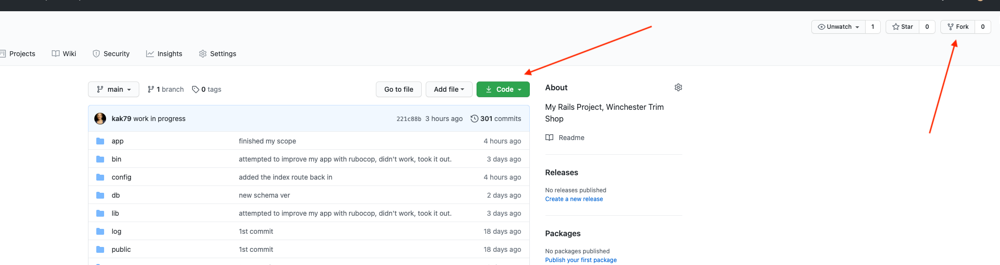

# README

[railsWTS](https://github.com/kak79/railsWTS)

## Table of contents

* [General info](#general-info)
* [Technologies](#technologies)
* [Setup](#setup)
* [Bundle && Yarn](#bundle&yarn)
* [Database Migration](#database)
* [Start your Server](#server)

## General info

This project is a website for an automotive upholstery shop.  It allows users (the shop workers) to log in via google or to create new users and log in on the site.  A user can create a vehicle owner, a car and a camper that belongs to that owner.  A user can edit it's profile and add an avatar.  A user can add up to 2 picture to a car and a camper.  A user can see the oldest and the newest car and camper and their owner on record on the owner's home page.

## Technologies

railsWTS is created with:

* Ruby version: 2.6.1
* Ruby on Rails version: 6.0.3
* Bootstrap version: 999
* Omniauth Google Oauth 2 version: 0.8.0

## Setup

To run this project, fork and clone it from:

[railsWTS](https://github.com/kak79/railsWTS)



Click on fork and then click on the green box that says Code on it and clone the the repository.  Then open a terminal of your choice in the directory where you want the app and enter the following commands.

```
mkdir folder_name
cd folder_name
git clone YOU_PASTE_THE_CODE_YOU_COPIED_FROM_BENEATH_THE_GREEN_BUTTON
```

### Google API Setup

Go to the [Google Developers Console](https://console.developers.google.com)

Select or make your project.
Go to Credentials, then select the "OAuth consent screen" tab on top, and provide an 'EMAIL ADDRESS' and a 'PRODUCT NAME'
Wait 10 minutes for changes to take effect.

* Create a `.env` file in the main directory of the railsWTS project.
* Put your client ID and Secred into your `.env` file as shown below

```
GOOGLE_CLIENT_ID=
GOOGLE_CLIENT_SECRET=
```

## Bundle && Yarn

The next steps are to install your Gemfile and make sure that yarn is up to date.  In the terminal of your choice...

```
bundle
```

If yarn complains, follow the directions to update it, if not, then you should be OK.

## Database Migration

Next you will need to migrate your database.  In the terminal please type the following.

```
rails db:migrate
```

## Start your Server

In order to start your rails server and display the railsWTS app in the browser please type the following in your terminal.

```
rails s
```

Now open a browser tab and enter this url

```
http://localhost:3000/login
```

Thank You!